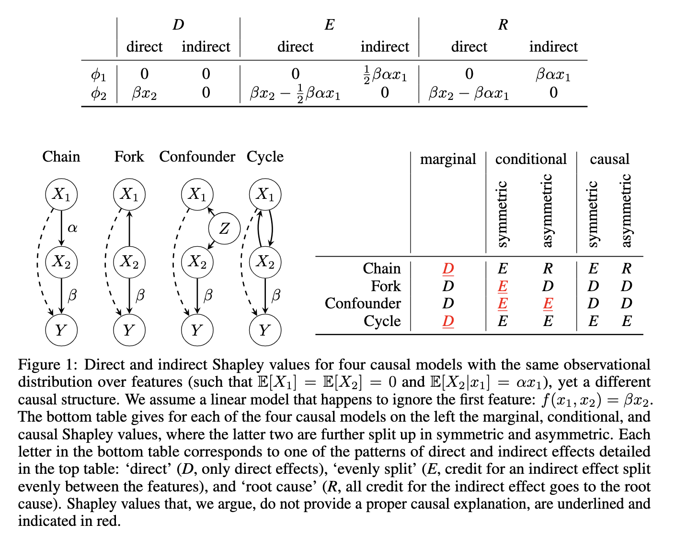

*Notes from the Explainable AI workshop on February 4, 2026. Topics include Shapley values for causal interpretations, xML methods for tree-based learners and survival analysis, computational aspects of Shapley values, and applications in omics.*

---

I put some effort into the takeaways at the beginning of each talk, otherwise these are the messy scribblings of a omics-based ML practitioner suddenly thrust into a very biostatistician-type workshop, and adapting on the fly to the different
academic cultures and suppositions about prior knowledge and what is easily understood by the audience. In other words: sorry for the inevitable misrepresentations and/or butchering of great statistical arguments beyond my ken. 

---

## Key Takeaways

* Use conditional Shapley values or the statisticians get mad. I think.
* Look at [shapr](https://norskregnesentral.github.io/shapr/articles/understanding_shapr.html) and its Python wrapper, and at shap-iq. 

---

## Session 1: Shapley Values & Variable Importance (09:30–10:55)

### Shapley Values with Bayesian Uncertainty Quantification for Rule Ensembles — Marjolein Fokkema

#### My takeaways:
* Can define rules based on interactions in tree-based models: use splits the trees learned as variables in a linear regression
* Now the generalized linear model has the explainability of linear terms + power of non-linear tree-based rules, but you can still reason about these rules
* Shapley values usually provide local or global importance of features, but not uncertainty estimates around their values (i.e. point estimates rather than Bayesian)
* Can get uncertainty estimates for the Shapley values.

Messy notes:

Talk about [RuleSHAP](https://arxiv.org/abs/2505.00571)
Marjolein comes from the school of meta analysis. There you have uncertainty estimates.

Starts with RuleFit 
Predicted value of Y = an estimated intercept, p predictor variables, and some extra term. Looks like a generalized linear model. What are these terms (akrk)?
$$F(x) = \hat{a}_0 + \sum_{k=1}^{q} \hat{a}_k r_k(x) + \sum_{j=1}^{p} \hat{b}_j x_j,$$

Example: depression treatment outcomes. A meta-analysis of psychotherapy versus pharmacotherapy. 694 observations from 7 studies. Treatment outcome: Depression rating scale score.

$pre_mod <- pre(HRSDt1 ~ Tx_group + Age + Gender )

pre = prediction rule ensembles R package. You see an effect of education. THe higher the education, the lower the post-treatment depression scale --> works better.
Then there are also rules learnt by tree ensembles: rule18 --> if baseline depression scale <= 24 you do better. rule61: baseline depression > 20 & Treatment_group == CBT: coefficient = 1.1, so then if you have a high depression score and you got CBT you had higher residual depression score after treatment.

How do you get these trees? You just fit some predictive ensemble, such as a random forest or a 
You discard the information in the leaf nodes, you only use the splitting rules learnt by the decision tree. So you code the membership of each of the data points for each of the rules. You extract these from each tree. You don't take all of them because you would get

Linear effects are particularly difficult to model with ensemble models so in this way you have the strength of linear effects + power of nonlinear (here: trees).

RuleSHAP
You use a [hierarchical horseshoe prior](https://claude.ai/share/c7ebe612-d8c2-4464-8e98-a866bf36ea75). Near zero the density becomes infinite. The horseshoe prior -> small coefficients gets forced much more to 0, large coefficients stay much closer to their original values. 

#### Example: cholesterol levels.
THey have 30,000 samples, but they went for subsampling first. n = 300, n = 1000, and n -= 5000. Of course Marjolein cares about interpretation, not just about the performance. In the 1980s this was already a problem. Collinearity. 

#### Short introduction to Shapley values.
j is a predictor of interest
Shapley value is a function of the model output (could be a predicted value for a single observation, or could be a global measure like the MSE or R^2 of the model). What is the effect of the predictor/variable/feature. Take all of the p features, and a subset of features s. The __payout__ is defined as the gain of the quantity of interest for sets of features that include the feature of interest versus those that do not include it.
Notoriously heavy computationally.

RuleSHAP: found a simplified expression for calculating proper shapley values. 

Marjolein is interested in how the health phenomenon works. She does not want the fitted model as a given and then Shapley values for that. She wants uncertainty estimates for the Shapley value. 
Joint Age + Sex effect --> Shapley values, separated by gender, Shapley value of age. Might be an interaction effect. 

### [A Principled Approach for Comparing Variable Importance](https://arxiv.org/abs/2507.17306) — Angel Reyero Lobo

#### My takeaways:
* To be very honest I did not get this talk at all. It seems to have unified variable selection and variable importance literatures in some way, but it flew over my head. Coprolite happens.
* It felt not very useful, or like the axiom used presupposed the conclusion, but that may be my misunderstanding. 

Messy notes:

Comparing different variable importance measures in a principled way. Use ML
models as a surrogate of the underlying distribution. 
Assumption of Identifiability: no feature is function of another feature. Assume that there has been a prior filtering or grouping.

### What does it mean to be important?
Covert et al. (2020) NeurIPS
important features as those whose absence degrades the ML model's performance.
There is a gap between variable importance and variable selection. 
Variable importance = some guar
Variable selection = have some guarantees on the features we are selecting

Now he has 2 features: X0 that is in the generative distribution of the data, and X2, which is not.
What is the minimum for a variable importance measure. Importance 

#### What is the state of the art on different variable importance measures:

1. LOCO --> Leave One Covariate Out:
Refit model without the covariate, and compare performance original model and performance of the model without some feature. 

2. PFI --> permutational feature importance:
Use the same model, predict with a perturbed input feature (permute the column).

With LOCO: we are basically comparing variable importances based on the inference used to at it.

Full disclosure: so statistical that I do not understand it at all. 

### Asymmetric Shapley Values to Quantify the Importance of Genes in Clinico-Genomic Applications — Jeroen Goedhart

#### My takeaways:
* If you have some causal model you can condition your Shapley values based on that --> get asymmetric Shapley values.
* May be useful in for instance combining clinical data with high-dim omics: gene expression causes the observed clinical variables, which in the end together leads to a certain survival time
* With these asymmetric Shapley values you can capture this, and more properly investigate how much adding omics information adds to the performance of your model: otherwise the clinical variable, since it is lower-dimensional and easier to model, can get more weight in the importance attribution.
* I missed biological detail/cancer knowledge. Just statistics experimentation that seems to work for now. But look at (asymmetric) Shapley values for known cancer genes, or microsatellite instability as an audience member remarked, etc. 

Messy notes:

#### Basic question in genomic prediction models:
* How relevant are the omics variables in cancer prediction models
* Low-dimensional strong signal --> Disease status, Age, Sex, etc.

If you combine the models, need to penalize the high-dimensional omics variables much more. 

Predict relapse-free survival based on colorectal cancer patients N = 845 (253 events).

He uses C-index, but that is not a great measure for survival? 

Shapley values are useful because:
* Allows to incorporate partial causal knowledge through asymmetric Shapley values
* Applies to any model (such as Blockforest which is apparently good at these types of clinical problems)
* Quantifies interactions, nonlinearites
* Both Global (for total performance) and Local (per-variable)

[Asymmetric Shapley values](https://proceedings.neurips.cc/paper/2020/hash/0d770c496aa3da6d2c3f2bd19e7b9d6b-Abstract.html) ignore subsets that do not respect the (causal) ordering.

He has a graphical model that genes -> disease status, and other clinical variables are confounders, and the outcome is survival.  

Splits out tumor in different stages and asks the per-patient importance of genes. Sees that in later stages it is more important.

My thoughts:
* In reality,  past gene expression is what causes current disease status. Not current.
* Uses C-index as performance metric, but see [this](https://arxiv.org/abs/2506.02075) and [this](https://pubmed.ncbi.nlm.nih.gov/36977424/)
* Nice question: if you would have more causal information/mediator for your DAG model or graphical model of how it works, what would you do? 

---

## Session 2: Causal Perspectives & Clinical Applications (11:15–12:25)

### [A Causal Perspective on Shapley Values](https://arxiv.org/abs/2011.01625) — Ioan Gabriel Bucur

#### My takeaways:
* If you have a causal model of some sort, incorporate it into the Shapley value calculation for better results (that's what I got out of it.)

Messy notes:

Speaker from Data Science at Radboud University

#### Talk main question: what is the relation of Shapley values to causality?

It is often easier for a model to get good predictions for the wrong reasons. 

The [role of causality in XAI](https://wires.onlinelibrary.wiley.com/doi/full/10.1002/widm.70015).

* Need to look at conditional distributions when you have dependent features.

We don't get additional causal structure out of the modelling, we just put in some causal structure that we know here.
Given a (graphical) causal model you would want/produce different Shapley values. 

Incorporate [do-calculus (Pearl)](https://www.joshua-entrop.com/post/the_3_rules_of_do_calculus.html) to Shapley values. Reason about distributions under intervention. 

Another extension to Shapley values: [rational Shapley values}(https://dl.acm.org/doi/abs/10.1145/3531146.3533170)

* Question asked by audience member: Compute causal Shapley values --> you have multiple interventional distributions. If you only care about some intervention X1, would it make sense to restrict the coalition to only those including that intervention?
* Answer: unsure as of yet. 

### Using Explainable ML for Assessing Treatment Effect Heterogeneity in Clinical Trials — Konstantinos (Kostas) Sechidis

#### My takeaways:
* [Stellar explanation of Shapley values](https://www.youtube.com/watch?v=aThG4YAFErw)
* Great application of causal/explainable model to an actual problem: are there heterogeneous treatment effects in clinical trials, or not? 
* Clinical trials are actually underpowered to detect this, and if you see assertions about subgroups they usually don't replicate.
* Great quote from the article: > "In addition, Hemmings [8] argues that “… Pharmacology, biology, and clinical practice are complex, and it may be argued that an assumption of complete homogeneity is rarely credible,” while, when simply assuming homogeneity there is also an error to make “… without full exploration of subgroups the other potential error, failing to identify a truly different effect in a subgroup of patients, will be made wherever the phenomenon exists. Ignoring the problem, and similarly routinely dismissing results of subgroup analysis, is no scientific solution. …”"
* Slides have a nice example of conditional average treatment effect. Which is related strongly to [treatment benefit prediction](https://pure.eur.nl/ws/files/46481397/thesistoshare.pdf). 
* Maybe check out doubly-robust learners for average treatment effects. 

Messy notes:

Treatment effect heterogeneity
Why is it challenging and why is it important?

Clinical trial failed
-> always some person who says 'but in women over 50, the response rate is 70% and only 30% in placebo
Subgroup analysis == assessing treatment effect heterogeneity
TEH: non-random varaition in treatment effects across levels of baseline patient features/characteristics/covariates. [Apparently the hardest problem there is](https://onlinelibrary.wiley.com/doi/full/10.1002/pst.2110?casa_token=pdw78PIPYVMAAAAA%3AWf0dZDm5ysT3zUxab07e0-glAjmORkPJOkzRdh-eaJmUbF5SO1d2v0NZ46PJEnTCzPH2GvcxQw9jMwyfXA). 
Hard problem because:
* high chances of false negatives due to insufficient sample size
* high chances because of false positives

64 RCTs with 117 subgroup claims. 
Only 5 of the 56 subgroup claims that had statistical significance in original paper would replicate. 
It does not do to just say 'well just don't trust subgroup analyses at all, leave the failed RCTs as they are and call it a day'. So what can we do?

Idea/sample solution:
[WATCH: a workflow to assess treatment effect heterogeneity in drug development for clinical trial sponsors](https://onlinelibrary.wiley.com/doi/full/10.1002/pst.2463?casa_token=DxDDp-KUp2sAAAAA%3AmcBYgoQjXmSYrNw7_Ypm6JmjpEh56dZbHgOiwSJh2RImOsTYWsrBuFA3FWU_OcM3RicRNTeTX-rsS0SFPA).
* Perform this in Phase 2 or Phase 3 clinical trials.

Steps:
* How strong is the overall evidence against the scenario of homogeneous treatment effects?
* Which variables drive observed heterogeneity?
* How does the treatment effect change with these variables?

[Nice explanation of Shapley values using taxi rides](https://www.youtube.com/watch?v=aThG4YAFErw)

Parallels to a model:
* players = taxi riders, in model: features
* total payof = total taxi fare, in model: model output for one example
* coalition = who is in the taxi so far, model coalition: all features
  
In the clinical trials we need more:
- EGFR mutation is predictive for benefit from Gefitinib, EGFR- = carboplatin-paclitaxel
- Here they know it --> can we have data-driven methodologies to discover this?
- So: which features influence treatment effect?

How to estimate individualized treatment effects:
* T-leaner, fit one model to outcome if treated, one to not-treated, subtract --> get average treatment effect
* S-learner, fit a single model with treatment as another feature. PRedict with both and subtract effect
* Way more methods, like DR-learner. 

[Towards optimal doubly robust estimation of heterogeneous causal effects](https://projecteuclid.org/journals/electronic-journal-of-statistics/volume-17/issue-2/Towards-optimal-doubly-robust-estimation-of-heterogeneous-causal-effects/10.1214/23-EJS2157.full)
In doubly robust learner the final CATE (averaged treatment effects) is just a supervised model and you can use Shapley values. 

---

## Session 3: Tree-Based Models, Survival Analysis & Software (13:55–17:00)

### Functional Decomposition of Tree-Based Models — Marvin Wright

#### My takeaways:
* If you have 3 features and you compute Shapley feature importances, there are actually importances for each feature individually but also for the features in combination. For the normal values, the importance of combos of feature 1 and 2 is equally distributed over feature 1 and 2, so you only get first-order importances (for individual variables). But you could do full functional decomposition: how important is feature 1, feature 2, feature 3, feature 1 and 2, feature 2 and 3, feature 1 and 3, and feature 1,2,3 together. 
* Problems are that you very quickly have infinitely many components (exponential in number of features) and that the right hand side of the functional decomposition is not unique: you could give a bit more importance to feature 1 and 3 and a bit less to feature 2 and 3 and get the same overall outcome. 
* Apparently with gradient-boosted trees, because they are additive and not too deep this problem is somewhat averted and you can do it.
* He showed an application to the IDEFICS dataset where they track children over time and predict later obesity from earlier variables, and could now show the interaction effects in the Shapley values. 
* Should use [FastPD](https://github.com/jyliuu/glex-rust) for tree-based Shapley values. 

Messy notes:

IDEFICS/I.Family
16,230 children. GWAS for n=3098 children. 2-10y until 7-17 years.
Features from an earlier timepoint --> XGboost --> obesity risk
Features: Age, Physical Activity, Screen time, polygenic risk score
MEan absolute SHAP value --> PRS (polygenic risk score) is the most important,
MVPA physical activity, 

You can see some Shapley value importances. Then PRS and region and physical activity are very important. 

'A local explanation that explicitly considers all interactions is a global explanation'.

Functional decomposition:
additive composition of all feature combinations.
Problems:
* Scales exponentially with the number of features. 
* Right-hand side is not unique (marginal = interventional; conditional = observational, baseline)
  

Gradient boosted trees = additive composition of single trees which are not that deep.
Many components are 0, so a low-depth tree makes functional decomposition easier.

What is the link between functional decomposition and SHAP values? 
* Similar to before, right-hand side is not identified
* Interaction effects are gone --> where are they?
Well, they are split among the individual features, a two-way interaction is 1/2 given to feature 1 and 1/2 given to feature 2. 

There are different TreeSHAP algorithms. Use [FastPD](https://arxiv.org/abs/2410.13448) for Shapley values. Because you get the full partial decomposition and it is better theoretically motivated. R package is [here](https://github.com/PlantedML/glex), Python + Rust implementation [here](https://github.com/jyliuu/glex-rust).
Check also this library: [shapiq](https://github.com/mmschlk/shapiq)

### [Interpretable Machine Learning for Survival Analysis](https://arxiv.org/abs/2403.10250) — Sophie Langbein

#### My takeaways:
* Beautiful use of flaticon images.
* really nice decomposition: what things are changing over time, what (interaction) effects are not time-dependent.
* great work on making survival models interpretable. Must-check resource before any work you do on survival analysis yourself.
* Some of the nicest plots in the presentation are not in [the paper linked](https://arxiv.org/abs/2403.10250), so need to find them.

GradSHAP --> use Shapley for neural networks. Nice.
What about interactions in survival models. 

Survival analysis background
Hazard function: instantaneous risk of event at a specifiek time
Survival function = probability of survival until some time
Cox proportional Hazards model = standard linear regression model.
Generalized risk score: (non-linear) feature transformation and (non-linear) time dependence

Iid = features with a constant effect on the risk over time
Id = features with a time-dependent effect on risk over time

If you do functional decomposition not on the log(hazard) but on the hazard function you get interactions. 

#### Real-world interactions

Really quite cool! Time-traces of shapley values for each patient.  

DeepHit survival neural network. Shapley applied to that, which patches are important? 

#### Conclusion
Interventional SHAP --> SurvFD and SurvSHAP-IQ. Explain interactions in survival models. Can only interpret model predictions, not have any causal interpretations. 

### Software Demo: [shapr — Conditional Shapley Value Explanation in R and Python](https://norskregnesentral.github.io/shapr/articles/understanding_shapr.html) — Martin Jullum

#### Main takeaways:
* [shapr](https://github.com/NorskRegnesentral/shapr) is the place to be for correct, well-implemented Conditional Shapley Values (the ones you actually want, the others use the marginal distribution and that doesn't work)

shapr R package with Python wrapper. 
Problem: conditional dependance issue in value functions for Shapley
The normal shap package is doing interventional shapley values, while they are doing conditional/observational shapley values.

* Uses KernelSHAP to approximate the Shapley value formula as a solution to a weighted least squares problem, then do approximations based on that. 

**Never use marginal/interventional Shapley values. Always use conditional ones. Even though they take longer to calculate**

### Is My Model Perplexed for the Right Reason? Contrasting LLMs' Benchmark Behavior with Behavior Specified via Token-Level Perplexity — Giovanni Cinà

#### My takeaways:
* Testing on the token level with a specific metric: does an LLM really understand certain linguistic concepts
* Basically, benchmarks for linguistic concepts are behaviourist, but can we also make quantitative metrics that we predefine, and check at this more precise level? 
* Example: made a dataset where they swapped in the prompt ambiguous and unambiguous sentences, and measured whether the LLM had perplexity on the right token.
* Concluded that it was often not and this is quite different from benchmark behaviour. My question was: isn't perplexity doing much more than just what you want it to do, what if the LLM is fine with producing untruths because it has seen them in so many texts/fiction etc.? Giovanni's response was that regardless of what happens we would want it to be surprised by this untruth if we are to say that it has the linguistic ability we bestow upon it based on the benchmark, because that is what we understand that linguistic ability to be: you should know it is wrong to say that a sentence is ambiguous and then write an unambiguous sentence.
* Lots of perplexity went to periods: apparently the model thought the sentences should be longer? I was thinking whether this was related to [attention sinks](https://huggingface.co/blog/tomaarsen/attention-sinks) but probably not.
* Only tested on Gemma (which?) and Mistral (which?) so far. 
* All in all it is an interesting idea but I did not find it super convincing as yet. 

Everything Giovanni works on is based on what he saw as problems in industry. How explainability techniques are used by clinicians in practice and what problems you get.

Attribution methods:
- what are the different contributions of different features. For tabular data it looks like this: go from black box to Shapley values for them as a waterfall plot. 

Suppose you get an image and an explanation:
you see the beak highlighted in a bird. Ornithologist might say: yes, the beak is important. Model might just like high-contrast pixels!

Confirmation bias: you have a tendency to favour/believe explanations that confirm our belief/conviction.
--> may sit down with clinicians and discuss what the model has learned, and then the clinicians will say 'yes, it is looking at the lungs, that is where the infection clusters, looks good!'. But: we onlu have Shapley values for features, not that it is doing that __because__ it has learned where the infection is.
Says it has a link to mechanistic interpretability as well, for instance with sparse autoencoders and the golden gate bridge.

You have benchmarks for LLMs --> they do a behaviouristic way of understanding. Input-output type thing. Look more into the models, are they doing what we want them to do. Do they have the concepts we have?

Find a way to formally specify a behaviour of interest. Find a metric to measure compliance with the behaviour. Side-step confirmation bias. 

What they did:
- express behaviour in terms of token-level perplexity
- prompt LLMs and measure token-level perplexity metrics
- then we can make conclusions about what they have learned.

Make a **correct** prompt:
'This is an ambiguous sentence: Andrei approached the person with a green chair', This is its unambiguous counterpart: 'Andrei approached the person who had a green chair.'
Now make the incorrect counterpart:
This is an ambiguous sentence: 'Andrei approached the person who had a green chair.' This is its unambiguous counterpart: 'Andrei approached the person with a green chair.'

LLM should have jump in perplexity. 

Is it necessarily so that the tokens you take as pivotal are pivotal?
Isn't perplexity just a bad metric, because perplexity is measuring all sorts of things and in general if the sentences are too short then that's not such a problem, right? 
-For attention you have these attention sinks

### MCCE: Monte Carlo Sampling of Realistic Counterfactual Explanations — Kjersti Aas

#### My takeaways:
* Counterfactual examples give no causal guarantees, they just say what the change would have had to be to get a different prediction given the model.
* This method of Monte Carlo sampling using dependence trees between variables to get new on-manifold samples is fast and delivers basically the best results.

Counterfactual explanations: what is the minimal change to the features of a loan applicant such that he would be accepted rather than denied?

MCCE = mounte carlo sampling of valid and realistic explanations for tabular data.
See paper [here](https://link.springer.com/article/10.1007/s10618-024-01017-y)

First fit CART (regression trees) to, for instance, the values of x3 given x1 and x2. So then the leaves have the distribution of x3 given some range of values for x1 and x2. 

With this, you can now generate a dataset. If you want fixed variables you can simply set them.

Take the Gower distance by either absolute distance of generated sample to factual sample, or for categorical if it is the same distance is 0, 1 otherwise.

Show that this works better for generating counterfactual samples.

---
